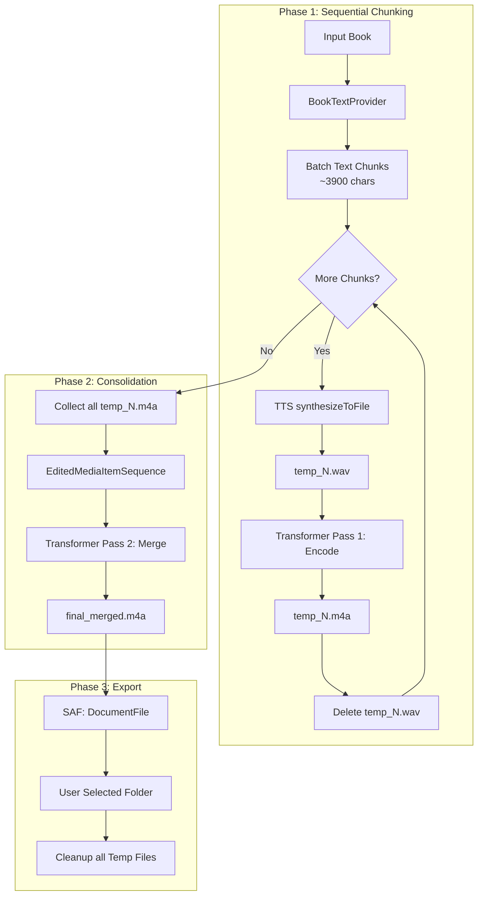

# Audiobook Generation Pipeline Documentation

## Purpose
This document describes the architectural flow of the AudioBookify pipeline, which transforms text-based documents (EPUB, TXT, HTML) into a single, unified `.m4a` audiobook file using Android's Text-to-Speech (TTS) engine and the Media3 Transformer API.

## Architectural Overview
The system follows a multi-stage, asynchronous pipeline managed by a foreground service to ensure reliability during long-running tasks. To maintain a clean architecture and manage device resources (storage and memory), the process is split into four distinct phases.

### 1. Text Extraction & Batching
* **Provider:** `BookTextProvider` handles the format-specific extraction (HTML stripping, EPUB parsing).
* **Batching:** Text is split into chunks (approx. 3,900 characters) to stay within the character limits of the Android TTS engine and to allow for granular progress tracking.

### 2. Phase 1: Synthesis & Transcoding (Sequential Loop)
For each text chunk, the pipeline performs a local conversion:
* **TTS Synthesis:** The text is sent to `tts.synthesizeToFile()`, resulting in an uncompressed `.wav` file.
* **Transcoding:** A Media3 `Transformer` instance converts the `.wav` to a compressed `.m4a` (AAC) file.
* **Eager Cleanup:** The intermediate `.wav` file is deleted immediately after transcoding to minimize disk usage.

### 3. Phase 2: Composition & Concatenation
Once all chunks are processed, the pipeline transitions from individual files to a unified stream:
* **Sequence Building:** An `EditedMediaItemSequence` is constructed containing all intermediate `.m4a` chunks.
* **Merging:** A second Media3 `Transformer` pass processes the `Composition`, stitching the chunks into one `final_merged.m4a` file.

### 4. Phase 3: SAF Export & Final Cleanup
* **SAF Write:** The final file is streamed from the app's internal cache to the user's selected destination folder using the Android Storage Access Framework (`DocumentFile`).
* **Final Cleanup:** All intermediate cache files are purged.

---

## Pipeline Flow Diagram

---

## Technical Components

| Component | Responsibility |
| :--- | :--- |
| **AudiobookService** | Lifecycle management, Foreground Notification, and Task Queueing. |
| **AudiobookPipeline** | Orchestration of TTS and Media3 Transformer passes. |
| **TextToSpeech (Android)** | The engine responsible for the actual voice synthesis. |
| **Media3 Transformer** | Handles hardware-accelerated encoding (WAV -> AAC) and seamless concatenation. |
| **DocumentFile (SAF)** | Manages scoped storage access to write the final result to user-selected paths. |

***

### Implementation Note for "My Coding Partner":
When modifying the code, remember that `AudiobookPipeline` relies on the `androidx.media3.transformer` package. Specifically:
* Use `EditedMediaItemSequence.withAudioFrom(list)` for concatenation.
* Ensure `onCompleted` and `onError` listeners are properly detached or handled to prevent memory leaks within the `AudiobookService`.
