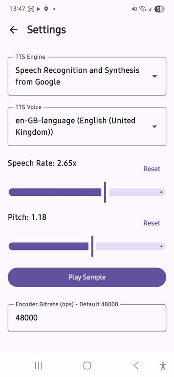
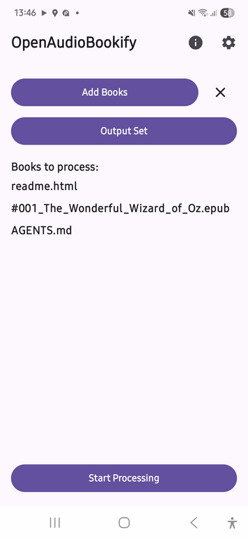
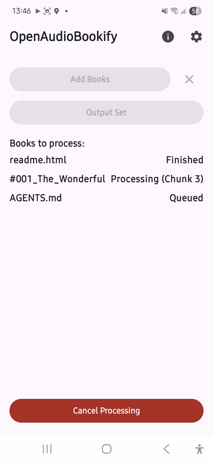

OpenAudioBookify
================

OpenAudioBookify is an open source Android app which allows you to select one or more plaintext, markdown, HTML or EPUB documents and generate an M4A audio file of the machine spoken ebook, which you can then load into your favourite podcast player.

OpenAudioBookify uses one of the system Text-to-Speech engines available on the device with whatever voices are available to that engine. The app likewise uses the system's audio encoding capabilities to produce the final audiobook. And it relies on the Storage Access Framework for input and output.

OpenAudioBookify itself does not depend on any cloud, online, or otherwise any form of subscription service -- it does all it does locally.

Installation
------------

You can download the apk from the project's [Releases](https://github.com/alzwded/OpenAudioBookify/releases). The APK is properly signed.

I have F-Droid and Play Store on the roadmap, but that's work which requires finding time to deal with people. Some day. Stay tuned!

### For the paranoid

You can, of course, build from source; which is what you should do if you are conscious about software security and that sort of thing. Perhaps ask your favourite LLM to search for malware and backdoors before you even run the gradlew script :-) This is not a jab at security conscious people, I, too, prefer things I can build from source than blindly trusting random APKs or random apps on some app store, regardless of how many SHA512's and public key signatures they throw in my face.

Usage
-----

You probably first want to hit the gear wheel in the top right and tweak your TTS voice (engine, voice, rate, pitch). The TTS engines shown as available are whatever is installed on your system, and accessible to regular apps.

You can also tweak the compressed output audio bitrate from the default 48kbps (which is about the lower limit before voices start to sound like underwater snakes).

At this point, you can select some books, select an output folder, and click "Start Processing".

You can return to the app periodically to see what it's doing, or stop it.

You will get a notification when it's done.

Note that the very first time you click "Start Processing" you'll get a prompt to allow notifications. I encourage you to permit notifications, as it allows the rendering to happen in the background while you go do something else. Modern Android OSes are very eager to silently shut down apps which aren't in the foreground, and speaking through an entire book can take many, many minutes. If you find it stopping without ever finishing, you might want to check your Android settings for "Battery Optimization" and set OpenAudioBookify to "Unrestricted".

License
-------

This project is licensed under a permissive [BSD License](./LICENSE).

This project lives at https://github.com/alzwded/OpenAudioBookify
